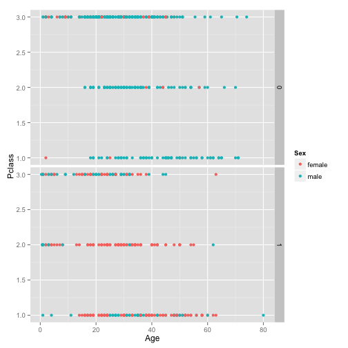

## Agenda

1. Background/Motivation
2. Code for plots
3. Guidelines to reproduce locally
4. For more information

--- .class #id 

## Background/Motivation

These are the files produced during a homework assignment of Coursera's MOOC Developing Data Products from Johns Hopkins University, where students could pick any dataset, and should produce a web app hosted on SaaS platform from RStudio shinyapss.io.

The data set that I choose was from Kaggle's Titanic Challenge, since this is a starting point for many Machine Learning enthusiasts. 

The materials can be found in:

Web app: https://dpaurelio.shinyapps.io/dpaurelio/

GitHub Repo: https://github.com/diogoaurelio/titanicShinyApp


--- .class #id 
## Code for plots

ggplot 2 Library was used for the plotting. Here is the code for a static view of the default plot that is rendered on the web app:

```r
library(ggplot2)
trainData <- read.csv(
url("http://s3-eu-west-1.amazonaws.com/dpadata/dataScience/train.csv"))
g <- ggplot(trainData, aes(Age, Pclass))
g + geom_point(aes(color=Sex)) + facet_grid(Survived ~.)
```

```
## Warning: Removed 125 rows containing missing values (geom_point).
## Warning: Removed 52 rows containing missing values (geom_point).
```

 


--- .class #id 

## Guidelines to reproduce locally

Guidelines to reproduce this project locally on your PC

To run locally this App on your computer you do NOT need to fork this repo. Please follow these instructions:

1. Install the necessary packages to run RStudio's Shiny Server locally. Please view the well documented requirements in the getting started page: http://shiny.rstudio.com/articles/shinyapps.html

2. Run the following command in the RStudio:

 runGitHub( "titanicShinyApp", "diogoaurelio")

Finito.

--- .class #id 

## For more information
For more information about the several MOOCs comprised in this Specialization, please visit:
https://www.coursera.org/specialization/jhudatascience/

For more information about RStudio Shinyapps.io visit:
http://shiny.rstudio.com/articles/shinyapps.html

For more information about Kaggle Titanic challenge visit:
https://www.kaggle.com/c/titanic-gettingStarted

Last but not least, if you are getting started with this challenge and R, here is a great tutorial from Trevor Stephens that inspired me to create this repo:
http://trevorstephens.com/post/72916401642/titanic-getting-started-with

--- .class #id 

## Last notes

Thanks you! 
Hope this might help you in starting out down the awesome data science and Machine Learning path.


